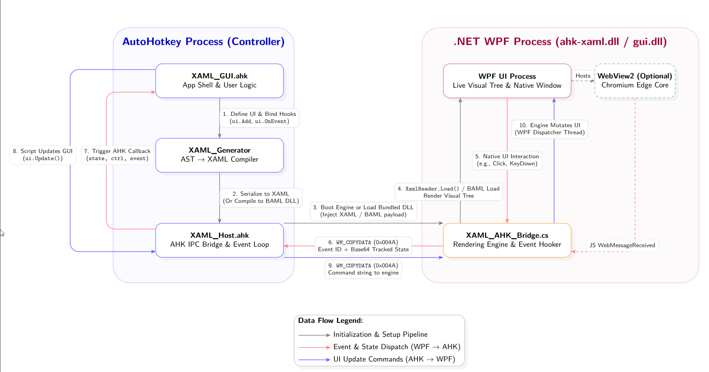

# AHK-XAML Framework

The modern, object-oriented framework for building native WPF (Windows Presentation Foundation) interfaces entirely within AutoHotkey v2.

[](ahk-xaml%20-%20Architecture.pdf)
*(Click diagram to view high-resolution PDF)*

By combining the speed of AHK with the rendering power of a compiled C# WPF engine, `ahk-xaml` allows you to create incredibly rich, hardware-accelerated, themable UIs without writing a single line of raw XML or dealing with complex thread-blocking UI code.

## Core Features

- **No Raw XAML Strings:** The powerful `XAML_Generator` builds your UI procedurally using a clean, chainable AHK method syntax.
- **Compiled Engine:** Uses a dynamically compiled, standalone C# executable (`ahk-xaml.dll`) to host the UI on a separate thread, ensuring your AHK logic never blocks the UI rendering, and the UI never blocks your AHK scripts.
- **Robust IPC:** Communication between AHK and WPF is handled via low-latency `WM_COPYDATA` messaging. Events (clicks, text input, window dragging) are automatically captured and passed to your AHK callbacks.
- **Pre-Built Component Library:** 50+ modern, Win11-styled components — from simple toggle switches and segmented buttons to full code editors, node graph visual scripters, data grids, and embedded Chromium browsers.
- **Dynamic Theming:** Supports hot-swapping themes by injecting WPF `ResourceDictionaries`. Fully integrates with Windows DWM (Desktop Window Manager) for native Mica/Acrylic effects and rounded corners.
- **Hot Reload:** Automatic state persistence across script restarts — text inputs, toggle states, slider values, and combo selections are saved and restored seamlessly.
- **Crash Diagnostics:** Rich error dialogs that trace WPF parsing errors back to the originating AHK source line, with XAML snippet context.
- **Production Builds:** Export your UI as a compiled `.baml` native WPF asset for zero-compilation deployment.

## Quick Start Example

Here is a minimal implementation to show how a UI is constructed and launched.

```ahk
#Requires AutoHotkey v2.0
#Include "lib\XAML_GUI.ahk"

; Toggle this flag for Development vs Production modes
global XAML_FORCE_DYNAMIC_COMPILE := true

; 1. Initialize the Main App Window
app := XAML_GUI("My Application", 800, 600)

if (XAML_FORCE_DYNAMIC_COMPILE) {
    ; 2. Build the UI using the generator syntax (Only needed in Development!)
    #Include "lib\XAML_Generator.ahk"
    
    app.Add("TextBlock").Text("Hello, World!").FontSize(24).Foreground("{DynamicResource TextMain}").HorizontalAlignment("Center").Margin("0,20,0,0")
    app.Add("Button").Name("BtnClickMe").Content("Click Me!").Width(120).Height(40).Margin("0,20,0,0").Cursor("Hand")

    ; 3a. Compile the dynamic UI into the memory host
    ui := app.Compile()
} else {
    ; 3b. Or load it instantly from a pre-compiled, standalone DLL bundle!
    ui := app.Load("gui.dll")
}

; 4. Bind events to AHK callbacks (Required in both modes)
ui.OnEvent("BtnClickMe", "Click", (state, ctrl, event) => MsgBox("Button Clicked!"))

; 5. Bundle everything into an ultra-fast standalone DLL in Dev Mode
; (Must be done AFTER bindings so that your events are serialized in the bundle)
if (XAML_FORCE_DYNAMIC_COMPILE) {
    app.ExportBundle("gui.dll")
}

; 6. Show the Window
app.Show()
```

## Component Highlights

| Category | Components |
|---|---|
| **Layout** | Grid, StackPanel, DockPanel, WrapPanel, SplitPanel, ScrollViewer |
| **Input** | TextBox, PasswordBox, ComboBox, Slider, SliderRange, NumericUpDown, HotKeyBox, SegmentedNetworkInput, SearchBox |
| **Selection** | CheckBox, RadioButton, ToggleSwitch, SegmentedBtn, Rating, EmojiPicker |
| **Display** | TextBlock, ProgressBar, ProgressRing, SkeletonLoader, SkeletonBlock, Avatar, Badge |
| **Data** | DataTableView, DataGridEx (search/filter/sort/pagination), Tokenizer |
| **Navigation** | TabControl, NavigationView, BreadcrumbBar, Stepper, CommandBar, XRibbon |
| **Visualization** | Sparkline, RadialGauge, StatCard, MetricCard, Timeline, XClock |
| **Advanced** | XNodeGraph, XCodeEditor, XDiffViewer, XPropertyGrid, XMediaPlayerEx, XImageCropper, XSvgViewer, KanbanBoard, MarkdownRenderer |
| **Overlays** | XDialog, XColorPicker, RichPopover, ContextMenu, Snackbar, FileDropZone |
| **Web** | XWebView (Chromium WebView2 with JS↔AHK bridge) |

## Directory Structure

```
ahk-xaml/
├── docs/
│   └── production-steps.md       # Steps for packaging/exporting to production (.baml)
├── lib/
│   ├── XAML_Host.ahk             # Core IPC bridge, engine compilation, message dispatch
│   ├── XAML_Generator.ahk        # Chainable AST → XAML compiler
│   ├── XAML_GUI.ahk              # High-level app scaffolding (window, tabs, sidebar, themes)
│   ├── XAML_Config.ahk           # Global flags (XAML_DEBUG, XAML_ENABLE_WEBVIEW)
│   ├── XAML_Components.ahk       # Standard & composite components, data grids, rating, emoji
│   ├── XAML_Adv_Components.ahk   # Advanced components (NodeGraph, CodeEditor, WebView, etc.)
│   ├── XAML_Dialog.ahk           # Modal dialog system (XDialog)
│   ├── XAML_AHK_Bridge.cs        # C# WPF engine source (compiled at runtime)
│   ├── xaml.components.xaml       # WPF ResourceDictionary (all control templates & styles)
│   └── WebView2/                 # WebView2 runtime DLLs (optional)
├── examples/
│   ├── basic/                    # Starter & helper scripts
│   │   ├── clean_modern.ahk      # Modern styling template
│   │   ├── ribbon_example.ahk    # Office-style ribbon toolbar
│   │   └── minimal_wrapper.ahk   # Core minimum implementation
│   ├── clones/                   # Premium replicas of popular UIs
│   │   ├── win11_settings.ahk    # Full Windows 11 Settings app clone
│   │   ├── vscode.ahk            # VS Code layout and sidebar clone
│   │   ├── spotify.ahk           # Spotify media player interface clone
│   │   ├── steam_launcher.ahk    # Steam games browser layout clone
│   │   └── chat_app.ahk          # Fluent chat and messaging UI clone
│   ├── showcase/                 # Rich component galleries & layouts
│   │   ├── basic_components.ahk  # All standard controls showcase
│   │   ├── advanced_components.ahk # Sparklines, clocks, gauges, and graphs
│   │   └── docking.ahk           # Multi-panel workspaces & window snapping
│   ├── data/                     # Mock data utilities
│   │   └── MockData.ahk          # Utility to feed lists, grids, and charts
│   └── themes.ini                # Application colors and styles definition file
├── README.md                     # Framework overview and quick start guide
├── Components.md                 # 50+ UI Components visual API dictionary
├── SyntaxAndPrinciples.md        # Lifetime, event flow, and syntax rules
└── ARCHITECTURE.md               # Core engine, compilation pipeline, and C# bridge
```


## Further Reading

This repository has been fully modularized. For deep dives into specific areas, please see the following documentation files:

1. [Components Guide](Components.md) - A definitive list of all 50+ UI components with coding examples.
2. [Syntax & Principles](SyntaxAndPrinciples.md) - Learn how the `XAML_Generator` works, scoped defaults, templates, theming, and the component lifecycle.
3. [Architecture](ARCHITECTURE.md) - Deep-dive into the two-process runtime, IPC bridge, compilation pipeline, state persistence, crash recovery, dynamic mutations, and production builds.
